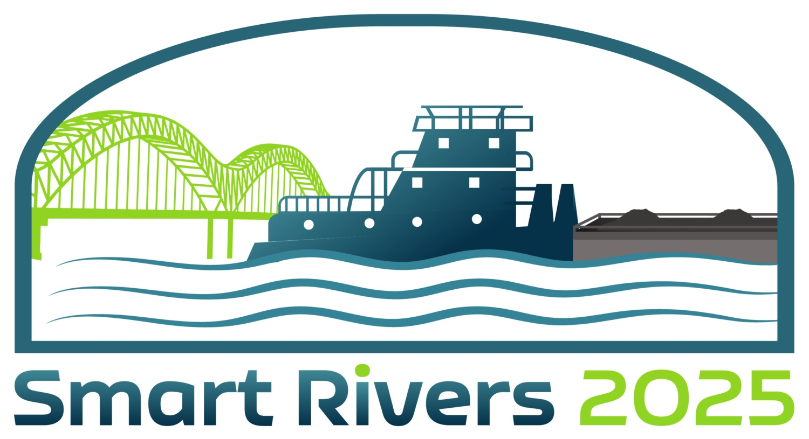

# **Course Logistics**

::: columns
::: {.column width="60%"}
[PIANC Smart Rivers 2025](https://smartrivers2025.com/)  
Monday, September 8, 2025  
1:30-4:30 PM  
Renasant Convention Center, 255 North Main St., Memphis, TN 38103  
Room 104  

Instructional team:

- Dr. Burton Suedel, Research Biologist, [Environmental Laboratory](https://www.erdc.usace.army.mil/Locations/EL/), U.S. Army Engineer Research and Development Center.  
- Calvin Creech, [Institute for Water Resources](https://www.iwr.usace.army.mil/), U.S. Army Corps of Engineers.  
- Dr. Kyle McKay, Environmental Director, [Woolpert](https://woolpert.com/)

:::

::: {.column width="40%"}
```{r echo=FALSE}

```
:::
:::

# **Overview**

Sustainable development of infrastructure systems is an emerging priority worldwide, and nature-based solutions are increasingly applied in navigable waterways to meet infrastructure needs as well as produce social and environmental benefits. This short course will cover how science-based guidance can inform decisions about waterborne infrastructure projects for two common areas of practice: sustainable sediment management and technical-biological bank protection. Participants will learn about the broader context for sustainable waterway management as well as technical guidance for executing these two types of nature-based solutions.

This short course emerged from three PIANC working groups addressing sustainable management of navigable waters. The following working groups and members are gratefully acknowledged for their direct and indirect contributions to this class:  

- Working group 214 - Topic - Chair, member, member.  
- Working group 236 - Topic - Chair, member, member.  
- Working group 128 - Technical-Biological Bank Protections for Inland Waterways - Bernhard Söhngen (WG Chair, Federal Waterways Engineering and Research Institute, Karlsruhe, Germany), Jeroen Verbelen (WG member, De Vlaamse Waterweg NV, Merelbeke, Belgium), Jos Wieggers (WG member, Rijkswaterstaat, Utrecht, Lelystad, The Netherlands), Kyle McKay (WG Member, Woolpert, New York, New York, USA), and Chris Haring (Coastal and Hydraulics Laboratory, U.S. Army Corps of Engineers, Rock Island, Illinois, USA).

# **Course Agenda**

- 1:30-1:45: Welcome and introductions (Suedel).  
- 1:45-2:30: The changing landscape of nature-based solutions (Suedel and McKay).  
- 2:30-2:45: Improving navigability of natural rivers with sustainable approaches (Creech).  
- 2:45-3:45: Sustainable sediment management (Suedel).  
- 3:45-4:00: BREAK.  
- 4:00-5:15: Technical-biological bank protection (McKay).  
- 5:15-5:30: Discussion and final remarks (Suedel).  

# **Nature-based solutions**

Insert blurb.  
Link to slides.  
Links to EWN, NEWN, World Bank, etc.  

# **Navigability of Natural Rivers**

Insert blurb.  
Link to slides.  
Links to working group.  

# **Sustainable Sediment Management**

Insert blurb.  
Link to slides.  
Links to DOER, DOTS, Working group, etc.  

# **Technical-Biological Bank Protection**

Insert blurb.  
Link to slides.  
Links to DOER, DOTS, Working group, etc.  

Working Group 128 products:  

- [Part 1: Basics of a best practice approach](https://www.pianc.org/publication/technical-biological-bank-protections-for-inland-waterways-part-1-basics-of-a-best-practice-approach/)  
- [Part 2: Library of measures](https://www.pianc.org/publication/technical-biological-bank-protections-for-inland-waterways-part-2-library-of-measures/)  
- [Part 3: Decision support advice](https://www.pianc.org/publication/technical-biological-bank-protections-for-inland-waterways-part-3-decision-support-advice/)  
- [Spreadsheet tools accompanying reports](https://pianc.app.box.com/s/uh6bfl1lg6zmtn7uqol3qzfsjz2u6xu7)

Other guidance documents and manuals on technical-biological bank protection:  

- England manual  
- Reclamation by Baird et al.  
- Others  
